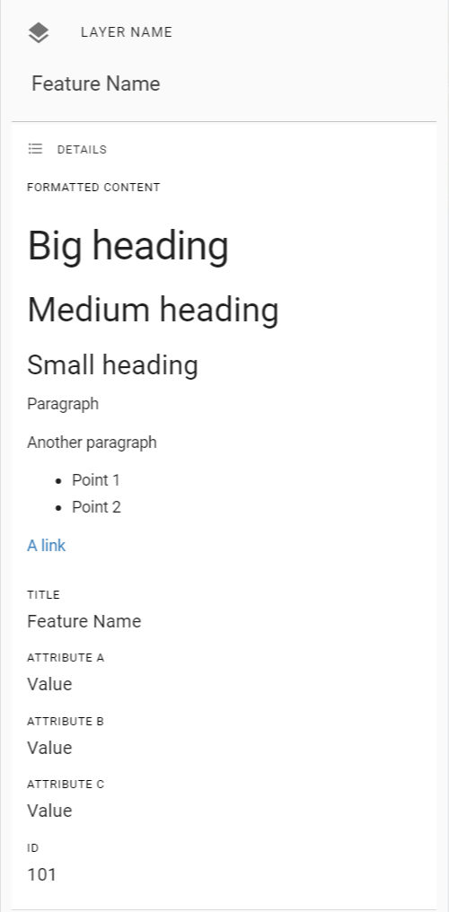

## *Under Construction*

*This page is a work in progress. Please refer to our existing Help Guide for information about this topic.*

[Existing Help Guide](https://help.pozi.com/search?query=configuring+data+sources){: .btn .btn-outline }

---

# Configuring Data Sources

## Attribute Formatting

### Hyperlinks

### Embedded Media

### Advanced Formatting

Attribute values containing valid HTML are rendered accordingly in the information panel.

Example feature:

```
  "features": [
    {
      "type": "Feature",
      "properties": {
        "Formatted Content": "<h1>Big heading</h1><h2>Medium heading</h2><h3>Small heading</h3><p>Paragraph</p><p>Another paragraph</p><ul><li>Point 1</li><li>Point 2</li></ul><p><a href=\"https://www.example.com/ \" target=\"_blank\">A link</a></p>",
        "Title": "Feature Name",
        "Attribute A": "Value",
        "Attribute B": "Value",
        "Attribute C": "Value",
        "ID": 101
      },
      "geometry": {
        "type": "Point",
        "coordinates": [
          145.04082,
          -37.92704
        ]
      }
    },
```

When this feature is selected in Pozi, it will display like this:


