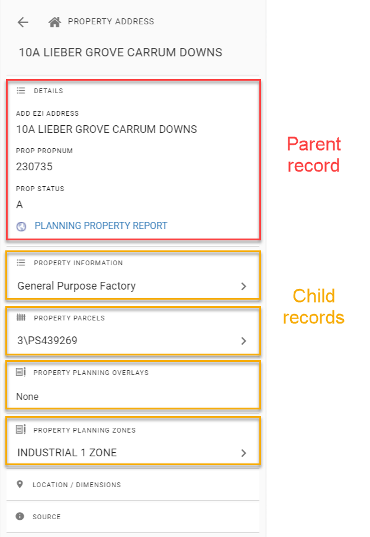

# Linking Datasets

## Details and Related Information

Pozi uses parent-child relationships between datasets to provide unlimited querying capabilities.

The parent record contains various attributes, such as the ones that are visible in the Details panel, other hidden attributes, and also the record's geometry. Any of these can be used as a key for querying other datasets. And any child record can become a parent of another dataset, and so on.

In the above example:

* `Property Information` is queried using the parent record's property number
* `Property Parcels` is queried using the parent record's property pfi
* `Property Planning Overlays` and `Zones` both use the parent record's geometry (ie, property boundary) in a spatial intersection query
