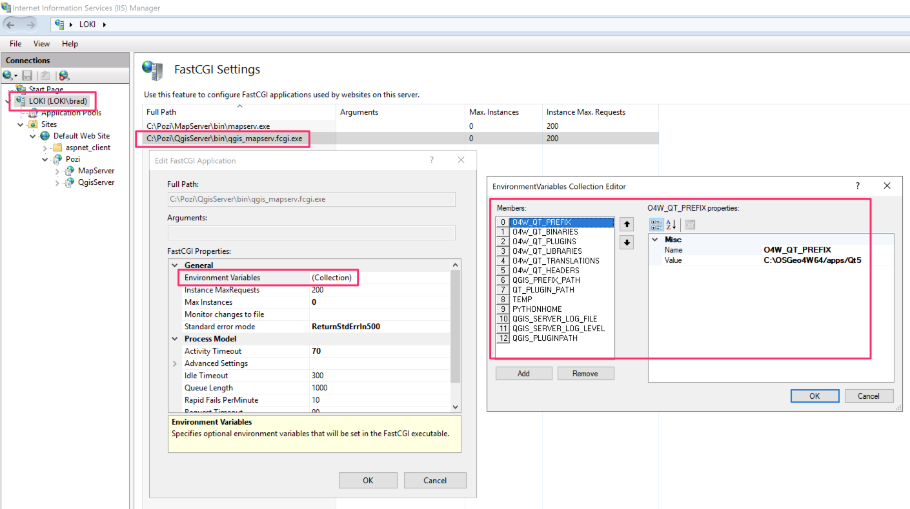
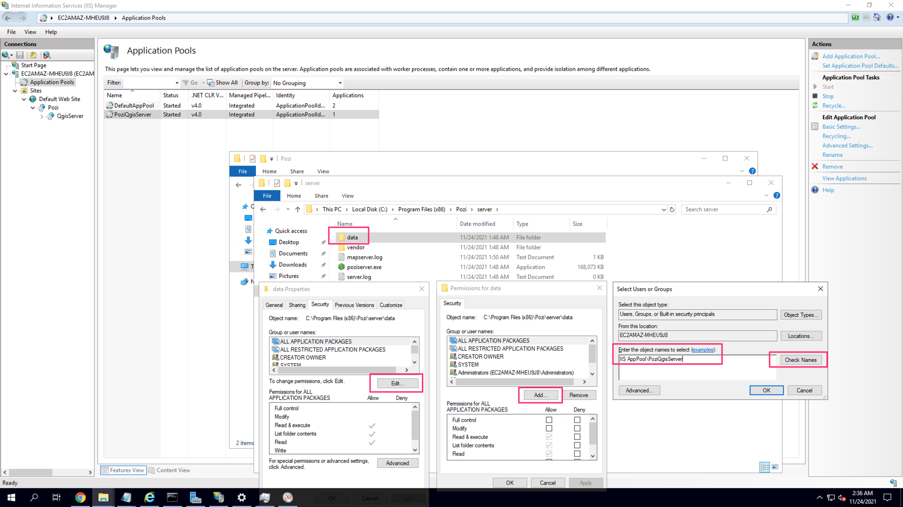

# MapServer

## Installation

On the server on which Pozi Server is installed:

MapServer is installed with Pozi Server in the following default location:

```
C:\Program Files (x86)\Pozi\server\Vendor\GDAL\bin\ms\apps\mapserv.exe
```


## IIS Integration

MapServer IIS Integration using FastCGI.

The default 

Open a command prompt window (as a normal user, not an administrator), and copy and paste these commands into it.

NOTE: Pozi Server 2.2.8 ships with default configuration files for MapServer IIS Integration using FastCGI -- the following folder is assumed to exist if you have installed Pozi Server to the default `C:\Program Files (x86)\Pozi` location:

```
C:\Program Files (x86)\Pozi\server\iis\Pozi\MapServer
```

### Install IIS

In a new command prompt window, running as administrator:

```
dism /online /enable-feature /featurename:IIS-WebServerRole
dism /online /enable-feature /featurename:IIS-WebServer
dism /online /enable-feature /featurename:IIS-ApplicationDevelopment
dism /Online /Enable-Feature /FeatureName:IIS-CGI
```


### Configure IIS

```
"%systemroot%\system32\inetsrv\appcmd" add app /site.name:"Default Web Site" /path:/Pozi /physicalPath:"C:\Program Files (x86)\Pozi\server\iis\Pozi"
"%systemroot%\system32\inetsrv\appcmd" add app /site.name:"Default Web Site" /path:/Pozi/MapServer /physicalPath:"C:\Program Files (x86)\Pozi\server\iis\Pozi\MapServer"
```

There should be `web.config` file located at the following path:

```
C:\Program Files (x86)\Pozi\server\iis\Pozi\MapServer
```

NOTE: If you have installed Pozi Server to a location other than the default `C:\Program Files (x86)\Pozi` then you will need to update that path in the `web.config` below:

```
<?xml version="1.0" encoding="UTF-8"?>
<configuration>
    <system.webServer>
        <handlers>
            <add name="PoziMapServerFastCgi" path="*" verb="*" type="" modules="FastCgiModule" scriptProcessor="C:\Program Files (x86)\Pozi\server\vendor\gdal\bin\ms\apps\mapserv.exe"
            resourceType="Unspecified" requireAccess="Script" allowPathInfo="false" preCondition=""  />
        </handlers>
        <caching enabled="true" enableKernelCache="true" />
    </system.webServer>
</configuration>
```

Back in the command prompt, run the following:

NOTE: If you have installed QGIS Server to a location other than the default `C:\Program Files (x86)\Pozi` then you will need to update that path in the commands below:

```
%windir%\system32\inetsrv\appcmd.exe unlock config -section:system.webServer/handlers

"%systemroot%\system32\inetsrv\appcmd" set config -section:system.webServer/fastCgi /+"[fullPath='C:\Program Files (x86)\Pozi\server\vendor\gdal\bin\ms\apps\mapserv.exe']" /commit:apphost

"%systemroot%\system32\inetsrv\appcmd" set config /section:isapiCgiRestriction /+"[path='C:\Program Files (x86)\Pozi\server\vendor\gdal\bin\ms\apps\mapserv.exe',description='PoziMapServer',allowed='True']"
```


Windows > IIS > select server > Fast CGISettings > select item we just configured > Edit > Environment variables:

```
PATH = C:\Program Files (x86)\Pozi\server\Vendor\GDAL\bin;C:\Program Files (x86)\Pozi\server\Vendor\GDAL\bin\gdal\python\osgeo;C:\Program Files (x86)\Pozi\server\Vendor\GDAL\bin\proj6\apps;C:\Program Files (x86)\Pozi\server\Vendor\GDAL\bin\gdal\apps;C:\Program Files (x86)\Pozi\server\Vendor\GDAL\bin\ms\apps;C:\Program Files (x86)\Pozi\server\Vendor\GDAL\bin\gdal\csharp;C:\Program Files (x86)\Pozi\server\Vendor\GDAL\bin\ms\csharp;C:\Program Files (x86)\Pozi\server\Vendor\GDAL\bin\curl;C:\Windows\system32;C:\Windows;C:\Windows\system32\WBem
GDAL_DATA = C:\Program Files (x86)\Pozi\server\Vendor\GDAL\bin\gdal-data
GDAL_DRIVER_PATH = C:\Program Files (x86)\Pozi\server\Vendor\GDAL\bin\gdal\plugins
PYTHONPATH = C:\Program Files (x86)\Pozi\server\Vendor\GDAL\bin\gdal\python;C:\Program Files (x86)\Pozi\server\Vendor\GDAL\bin\ms\python
PROJ_LIB = C:\Program Files (x86)\Pozi\server\Vendor\GDAL\bin\proj\share
```



### Application Pool

- Create PoziMapServer application pool

```
"%systemroot%\system32\inetsrv\appcmd.exe" add apppool /name:"PoziMapServer"

"%systemroot%\system32\inetsrv\appcmd.exe" set config -section:system.applicationHost/applicationPools /+"[name='PoziMapServer'].recycling.periodicRestart.schedule.[value='02:00:00']" /commit:apphost
```


Set the user for the PoziMapServer application pool:

- IIS > select server > Sites > Default Web Site > Pozi > MapServer > Advanced Settings > Application Pool > set to PoziMapServer

Set permissions for ```IIS AppPool\PoziMapServer``` :

- IIS > select server > Application Pools > PoziQgisServer > Advanced settings > Identity > Application Pool Identity > Custom account > enter details of the domain user that runs Pozi "service" account



## Reference for Pozi Developers

Development notes that may contain useful additional information for Pozi developers.

* https://github.com/pozi/PoziServer/pull/40#issuecomment-972331899


## Configuring Clean Urls for MapServer FastCGI


`/Pozi/MapServer/Next/VicMapFeatures`


```
"%systemroot%\system32\inetsrv\appcmd.exe" add apppool /name:"PoziQgisServer"
```
