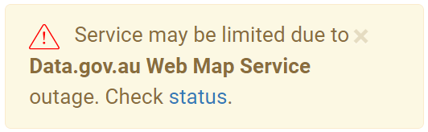

# Service Monitoring

[Pingdom](https://my.pingdom.com/app/3/home)

## Public Status Page

Public view: http://stats.pingdom.com/w3ggvgl5rino
Settings: https://my.pingdom.com/app/reports/public

## Outage Message



Pozi will display this message if any of the following services are down:

```
checks: {
    include: {
    'Data.gov.au Web Map Service': true,
    'DELWP DataVic Web Map Service': true,
    'DELWP Image Web Server': true,
    'Pozi App': true,
    'Vicmap API Map Tile Service': true
    }
}
```

https://github.com/pozi/PoziApp/blob/master/app/src/utils/pingdom.js#L26-L32

To prevent an unwanted warning from displaying to users (for instance, if a service is experiencing a long outage), change the check's name in Pingdom.
